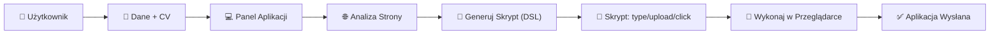

# Codialog: Inteligentny Asystent Automatyzacji

`Codialog` to zaawansowany system, który automatyzuje proces wypełniania formularzy online i wysyłania aplikacji, np. podczas rekrutacji. Wykorzystuje duży model językowy (LLM) do analizy stron internetowych i generowania skryptów automatyzacji, które następnie wykonuje, oszczędzając Twój czas.

## 🎯 Kluczowe Funkcje

- **🤖 Inteligentne Wypełnianie Formularzy**: Automatyczne uzupełnianie pól na podstawie dostarczonych danych (np. z CV).
- **📄 Automatyczny Upload CV**: Bezproblemowe przesyłanie plików PDF/DOC do formularzy aplikacyjnych.
- **🧠 Generowanie Skryptów przez LLM**: System analizuje kod HTML strony i dynamicznie tworzy skrypty automatyzacji w dedykowanym języku (DSL).
- **⚙️ Wykonanie przez TagUI**: Rzeczywista automatyzacja interakcji w przeglądarce (klikanie, pisanie, przesyłanie plików).
- **🐳 Pełna Konteneryzacja (Docker)**: Gotowe środowiska deweloperskie, testowe i produkcyjne dla łatwego uruchomienia i skalowania.
- **🧪 Kompleksowe Testowanie**: Wysokie pokrycie testami jednostkowymi, integracyjnymi, E2E (Playwright) i wydajnościowymi (k6).
- **📊 Monitoring i Obserwowalność**: Zintegrowany stos monitoringu z Prometheus, Grafana, Loki i Jaeger do śledzenia metryk, logów i wydajności.
- **🚀 Zautomatyzowane CI/CD**: Potok CI/CD na GitHub Actions zapewniający linting, testowanie, budowanie i wdrażanie aplikacji.

## 💡 Przykład działania

Przepływ pracy systemu jest prosty i skuteczny:



### Przykład wygenerowanego skryptu (DSL)

```dsl
// LLM analizuje formularz i generuje poniższy skrypt
click "#login-btn"
type "#username" "jan.kowalski"
type "#password" "SuperTajneHaslo!"
click "#submit"

type "#fullname" "Jan Kowalski"
type "#email" "jan.kowalski@example.com"
upload "#cv-upload" "C:/Users/Jan/Documents/CV.pdf"
click "#apply-submit"
```

## 🚀 Pierwsze Kroki

System jest w pełni skonteneryzowany, co sprawia, że uruchomienie go jest niezwykle proste.

### Wymagania

- [Docker](https://www.docker.com/get-started)
- [Docker Compose](https://docs.docker.com/compose/install/)
- `make` (opcjonalnie, ale zalecane dla łatwiejszego zarządzania)

### Instalacja i Uruchomienie

1. Sklonuj repozytorium:
   ```bash
   git clone https://github.com/codialog/tauri
   cd tauri
   ```

2. Uruchom wszystkie usługi za pomocą jednego polecenia:
   ```bash
   # Jeśli masz `make`
   make up

   # Alternatywnie, używając Docker Compose
   docker-compose up -d
   ```

3. Aplikacja będzie dostępna pod adresem: [http://localhost:1420](http://localhost:1420)

## 🛠️ Zarządzanie i Testowanie

Dzięki `Makefile` zarządzanie środowiskiem jest proste:

- **Uruchomienie wszystkich testów** (jednostkowe, integracyjne, E2E):
  ```bash
  make test-all
  ```

- **Dostęp do panelu monitoringu** (Grafana):
  ```bash
  make monitor
  ```

- **Zatrzymanie usług**:
  ```bash
  make down
  ```

## 📁 Struktura Projektu

```
codialog/
├── .github/         # Workflows CI/CD (GitHub Actions)
├── docker/          # Konfiguracja Dockerfiles dla poszczególnych usług
├── monitoring/      # Konfiguracja Prometheus, Grafana, Loki
├── scripts/         # Skrypty pomocnicze (np. backup, setup)
├── src-tauri/       # Kod backendu (Rust)
├── src/             # Kod frontendu (JavaScript, HTML, CSS)
├── tests/           # Wszystkie testy (unit, integration, e2e, performance)
├── Makefile         # Polecenia do zarządzania projektem
├── docker-compose.yml # Główny plik Docker Compose
└── README.md        # Ta dokumentacja
```

## 📜 Licencja

Projekt jest udostępniony na licencji [MIT](LICENSE).
